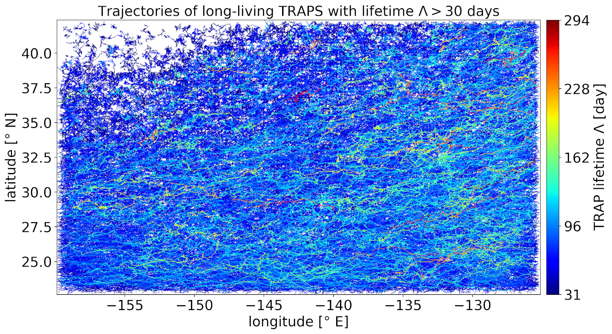

# Track and analyse Transient Attracting Profiles in the Great Pacific Garbage Patch

---

## Summary
This repository provides software to track and analyse Transient Attracting Profiles (TRAPs, [Serra et al. (2020)](https://doi.org/10.1038/s41467-020-16281-x), [Serra and Haller (2016)](https://doi.org/10.1063/1.4951720)) in the Great Pacific Garbage Patch, see [Kunz et al. (2024)](https://doi.org/10.5194/egusphere-2024-1215) for a detailed  analysis.

The software post-processes raw output of the TRAPs detection algorithm  by [Mattia Serra (2020)](https://github.com/MattiaSerra/TRAPs) into two comprehensive datasets:
1) the `TRAPS GPGP` dataset: This dataset contains 20 years of TRAP detections with various attributes like e.g. TRAP lifetimes, propagation speeds and pattern detections in the surrounding vorticity field.

2) the `TRAPS DRIFTERS HPS` dataset: This dataset contains 20 years of drifter-TRAP pair detections with attributes like e.g. drifter-TRAP distances,  drifter retention times and TRAP attraction strengths.

Both datasets are available at:  
  

For supplementary videos, see:  

---

## Files

You can use these scripts to open the datasets and follow the analysis in Kunz et al. (2024):  
`aa_define_classes.ipynb`  
`rxa_read_TRAPS_GPGP.ipynb`  
`rxb_read_TRAPS_DRIFTERS_HPS.ipynb`  
`rxc_ANALYSIS_EXAMPLES.ipynb`  
Make sure you adopt the directory structure that is provided within the data repository. All other scripts in here describe the procedures needed to produce these datasets. The markdown files give a summary of each processing step:

1) `ca__________POSTPROCESSING__________.md`
2) `da__________TRACKING__________.md`
3) `ea__________VORTICITY_PATTERNS__________.md`
4) `fa__________TRAPS_DRIFTERS__________.md`
5) `rx__________READ_FILES__________.md`

Especially, the file `daa_build_TRAPS_TRACKED.ipynb` presents the tracking algorithm which estimates TRAP lifetimes and trajectories. All python scripts in here are identical to the same-named Jupyter Notebooks. Use the .yml file to set up the working  environment via:  
`conda env create -f trapsgpgp_condaenvexport.yml`  
or  
`conda create -n trapsgpgp -f trapsgpgp_condaenvexport.yml`

---

## Source data

Raw TRAPs and relative vorticity are derived from daily snapshots of near-surface geostrophic + Ekman currents from the product Global Total Surface and 15m Current (COPERNICUS-GLOBCURRENT) from Altimetric Geostrophic Current and Modeled Ekman Current Reprocessing that is provided by the E.U. Copernicus Marine Service ([CMEMS, 2022a](https://doi.org/10.48670/moi-00050)). Surface drifter positions have been consulted from the Global Drifter Program ([Lumpkin and Centurioni, 2019](https://doi.org/10.25921/7ntx-z961)). The data repository does not include raw TRAP detections, raw drifter data or relative vorticity fields but they can be shared upon request.

---

## Acknowledgements

This work is a contribution to the project [L3 Meso- to submesoscale turbulence in the ocean](https://www.trr-energytransfers.de/research/area-l/l3) of the Collaborative Research Centre TRR 181 Energy Transfer in Atmosphere and Ocean funded by the German Research Foundation (DFG) and has been conducted in collaboration with [The Ocean Cleanup](https://theoceancleanup.com/). 

---

## Please cite

The repository is licensed under the GNU General Public License v3.0. © 2024 Luca Kunz. When using the software, please cite [Kunz et al. (2024): "Transient Attracting Profiles in the Great Pacific Garbage Patch"](https://doi.org/10.5194/egusphere-2024-1215) and provide a link to the repository.

---

## Happy coding!

